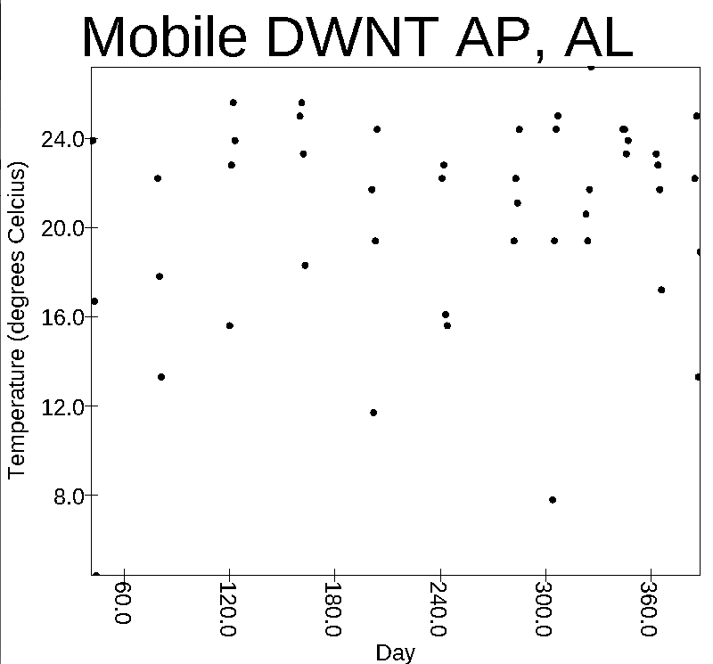
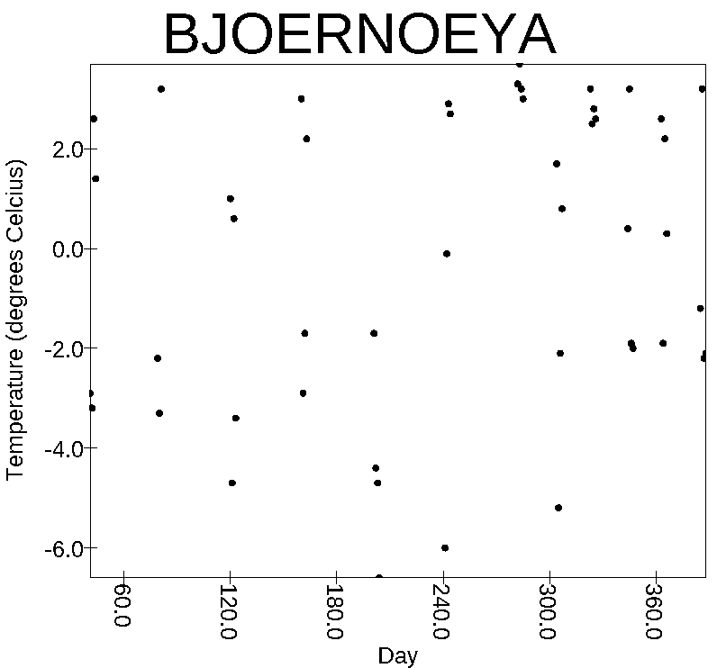
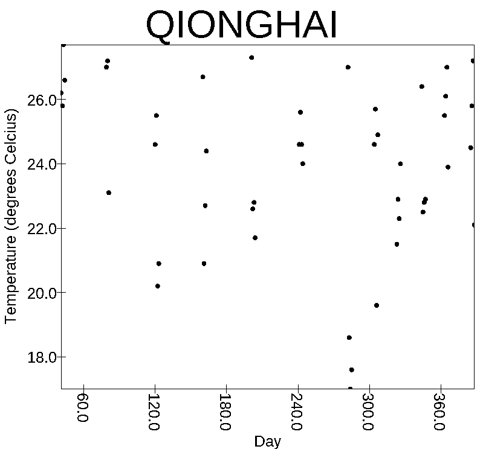
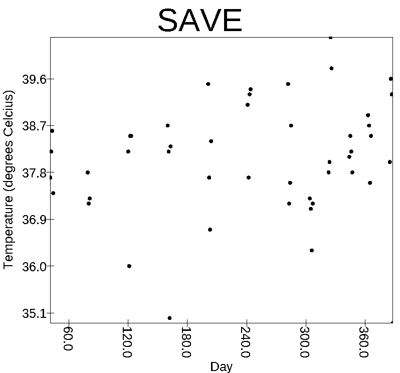

## Big-Data: Spark/RDD Problems
##### 1. How many stations are there in the state of Texas?
*     4736 stations
##### 2. How many of those stations have reported some form of data in 2017?
*     2492 stations
##### 3. What is the highest temperature reported anywhere this year? Where was it and when?
*     89.1 degrees C in Blackwater, WY on September 6th
##### 4. How many stations in the stations list haven't reported any data in 2017?
*     66351 stations
##### 5. What is the maximum rainfall for any station in Texas during 2017? What station and when?
*     932mm by Lukfin Anfelina CO AP(USW00093987) station on August 27th.
##### 6. What is the maximum rainfall for any station in India during 2017? What station and when?
*     436.1mm by BHUBANESWAR(IN01711200) station on March 9th
##### 7. How many weather stations are there associated with San Antonio, TX?
*     29 stations
##### 8. How many of those have reported temperature data in 2017?
*     12 stations
##### 9. What is the largest daily increase in high temp for San Antonio in this data file?
      105.0 degrees C  (Most likely an error in data or my inputting of it.) Second highest was 25.0 degrees Celcius.
##### 10. What is the correlation coefficient between high temperatures and rainfall for San Antonio? Note that you can only use values from the same date and station for the correlation.
      -0.0783 or 7.83%
##### 11. Make a plot of temperatures over time for five different stations, each separated by at least 10 degrees in latitude. Make sure you tell me which stations you are using.
---

---

---

---
  
---

